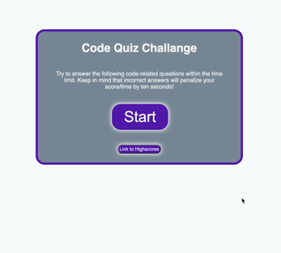

# Coding-Quiz-Challenge
Using javascript to create a quiz utilizing dynamic elements and local storage for highscores

https://katiec2116.github.io/Coding-Quiz-Challenge/

## Overview

This is a timed code quiz with multiple-choice questions. This app will run in the browser and features dynamically updated HTML and CSS powered by JavaScript code. It features a clean and polished user interface and responds to multiple screen sizes. Highscores are stored in local storage.

   

## Features

## License

MIT

## Tests

No tests available

---

